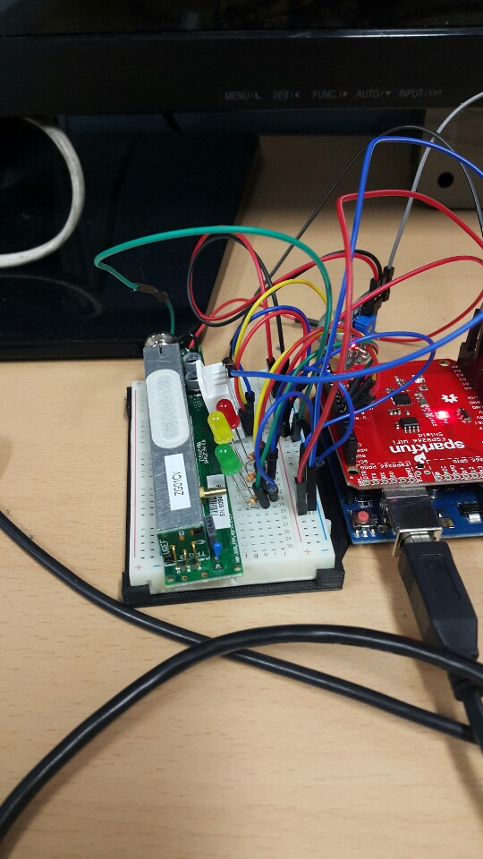
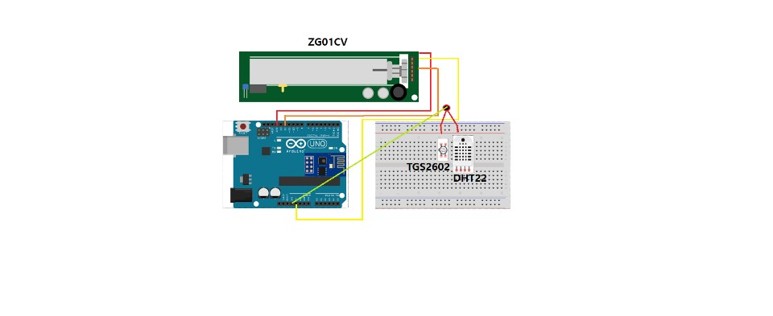
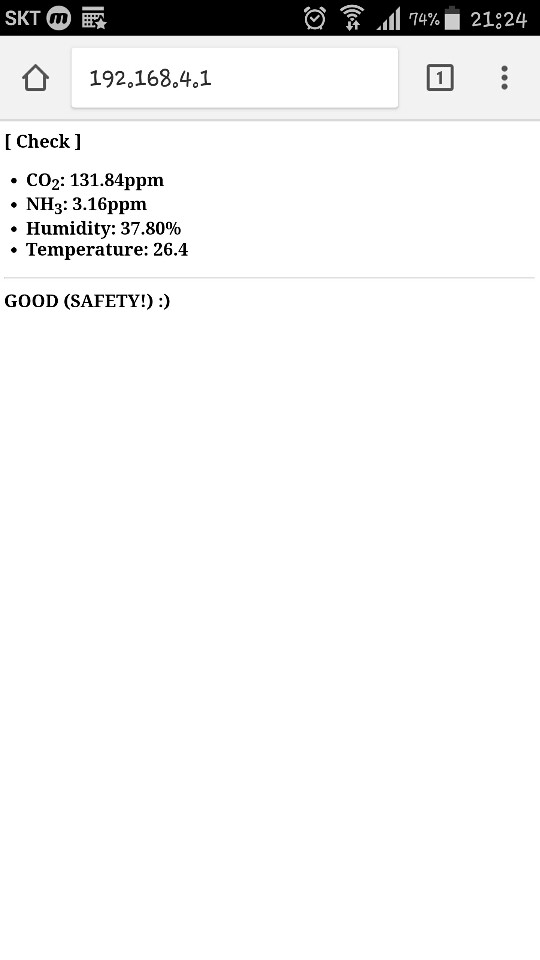
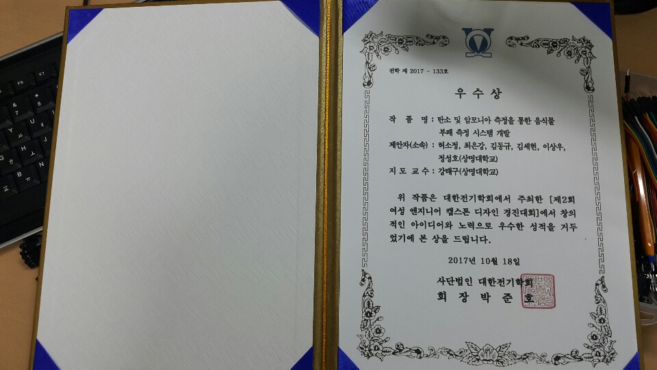

# 2017년도 대한전기학회 여성캡스톤 디자인 #
## 주제: 탄소 및 암모니아 측정을 통한 음식물 부패 측정 시스템 개발 ##
#### 팀원: 정성호(팀장), ***최은강***, 허소정, 김세현, 김동규, 이상우 
#### 지도 교수님: 강태구(휴먼지능로봇학과)
#### 활동기간: 2017년 08월 ~ 2017년 10월
#### 담당역할: 임베디드 소프트웨어 개발(아두이노로 센서 코드 작성, 웹앱 구현)
##### * 2학년 2학기 때 로봇동아리(휴머노이드 로봇클럽)에서 활동한 결과이다.
##### * 데이터를 보관했던 외장하드의 포맷으로 인해 자료가 많이 부족했다.
##### * SparkFun-ESP8266-WiFi-Shield를 통해 처음으로 아두이노uno보드와 웹을 연결시켰다.
##### * 웹앱의 html 파일을 더 화려하게 꾸미고 싶었지만, 꾸미면 꾸밀수록 속도가 느리고, 글씨가 깨졌다.
- - -
## 1. 실제 모습 ##

-----------------------------------------------------------------------
## 2. 회로도(Fritzing) ##

-------------------------------------------------------------------------------------
### * 사용한 센서 ###
        * SparkFun ESP8266 WiFi Shield : AP모드를 이용하여 웹에 접속하도록 함.
        * ZG01CV: 이산화탄소 측정센서
        * DHT22: 온도 & 습도 측정센서
        * TGS2602: 암모니아 측정센서
        * LED(R/Y/G): 음식물의 부패도를 나타내는 LED(Green: 안전, Yellow: 보통, Red: 나쁨)
        
### * 이전과 현재의 변화
##### 이전에도 본인(최은강)을 제외한 나머지 학생들끼리 비슷한 주제로 작품을 구현한 적이 있었다.
##### 본인이 이 프로젝트에 참여함으로써 개선시킨 점을 아래에 소개한다.
 1. (이전) RFID & 블루투스 모듈  
 ▶ (이후) SparkFun WiFi Shield
 
 2. (이전) 안드로이드 APP Inventor으로 만들어서 와이파이 모듈을 이용해 정보전송 (와이파이와 연결하기 위한 재료가 많이 필요하고 처리과정이 복잡함. 멀리떨어진 곳에서도 통신이 가능하다.)
 ▶ (이후) WiFi Shield의 AP(Access Point) 모드로 모바일과 웹이 연결됨. (shield 하나로 s/w로 웹과 연결 가능. 통신하는데 거리제약이 있다.)
 (Shield의 WiFi에 접근한 모바일은 부패도 측정을 위한 웹앱에만 접속이 가능하다. 네이버 라던가 구글 기존의 홈페이지로의 접속은 불가능하다)
 
 3. (이전) 가스측정 측정센서(MQ5): 암모니아뿐만 아니라 다른 가스도 측정한다.
 ▶ (이후) 암모니아 측정센서(TGS2602), 이산화탄소 측정센서(ZG01CV):  암모니아만을, 이산화탄소만을 측정하는 센서와 관련된 라이브러리를 사용.
         
----------------------------------------------------------------------------------------
### * 웹앱에서 나타나는 센서 출력 결과(tryWeb.html) ###
##### * 안드로이드 스튜디오로 앱을 만드는 대신에 HTML을 이용하여 웹앱을 만들었음.
##### * 특정 IP주소가 담긴 앱으로 접속하여 현재 음식물의 부패도 측정결과를 보여줌

- - -
## 3. 결과물 (우수상 수상!)

